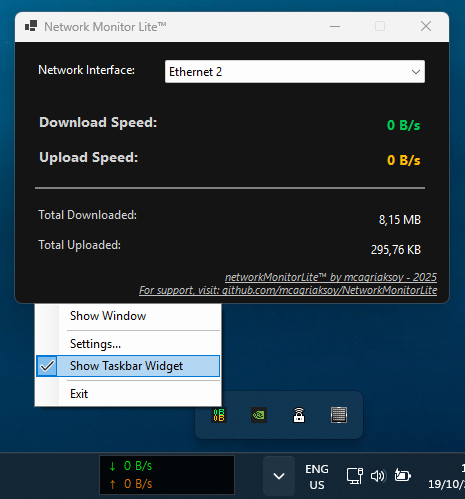
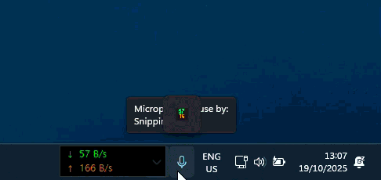

<a href="https://github.com/mcagriaksoy/networkMonitorLite" title="Go to GitHub repo"></a>
<a href="https://github.com/mcagriaksoy/networkMonitorLite/releases/"></a>
<a href="#license"></a>
<a href="https://github.com/mcagriaksoy/networkMonitorLite/issues"></a>

NetworkMonitor Lite is a tiny (140KB), malware-free Windows app that shows live upload/download speeds in a clean interface, system tray icon, and draggable taskbar widget. Lightweight, portable, and fully compatible with Windows 11.

## Points seperated networkMonitorLite from others

- Tiny footprint – just 140KB, making it ultra-fast and resource-friendly
- No malware, no bloat – clean and safe for all systems
- Windows 11 compatible – runs smoothly on modern setups
- Instant visibility – see your network performance at a glance
- No installation required – portable and easy to use

## Features
- Live download and upload speed monitoring per active network interface
- Minimal taskbar widget you can drag and place near the system tray
- Tray icon with compact live speeds (no GDI leaks)
- Settings to customize:
  - Widget background color
  - Download and upload text colors
  - Font family, size, and style
- Settings persist across sessions (stored in AppData)

## Screenshots

Main UI:



How to Open the taskbar widget:



## Requirements
- Windows 10/11
- .NET 8.0 for Windows (TargetFramework: `net8.0-windows`)

## Build and Run
You can open the project in Visual Studio or use the .NET SDK from PowerShell:

```powershell
# Build
dotnet build

# Run
dotnet run
```

## Usage
1. Pick a network interface at the top of the main window.
2. Watch live speeds (Download/Upload) and total transfer amounts.
3. Use the tray icon menu:
   - Show Window: bring the main window to front
   - Settings…: open customization dialog
   - Show Taskbar Widget: toggle the small draggable overlay
   - Exit: quit the app

### Settings
- Right-click the tray icon and choose "Settings…" to customize:
  - Taskbar widget background color
  - Download and upload text colors
  - Font family, size, and style
- Settings are saved to:
  - `%APPDATA%\NetworkMonitorLite\settings.json`
  - They load automatically on startup and apply to the widget.

## Taskbar Widget behavior
- The widget is set TopMost and additionally forced to the top Z-order using `SetWindowPos` to avoid slipping behind the taskbar.
- You can drag it by holding the left mouse button anywhere on the widget.

## Notes
- The tray icon is drawn on the fly; icon handles are cloned and destroyed to prevent GDI leaks.
- If the primary screen is not available, the app falls back to the first available screen.
- If you don’t see any interfaces, ensure the adapter is up; administrative privileges are typically not required.

## Support
- Author: mcagriaksoy — https://github.com/mcagriaksoy/NetworkMonitorLite

